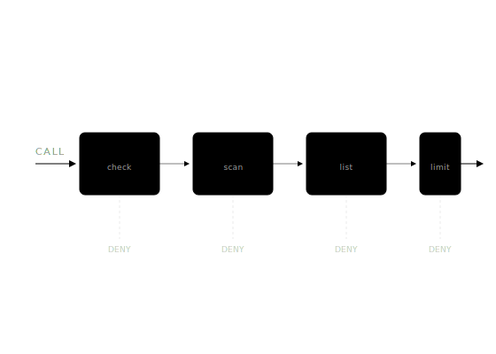
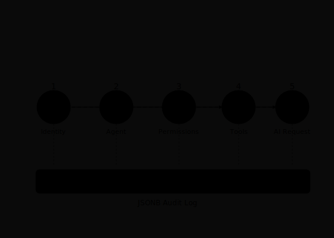
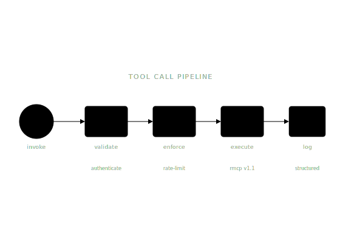
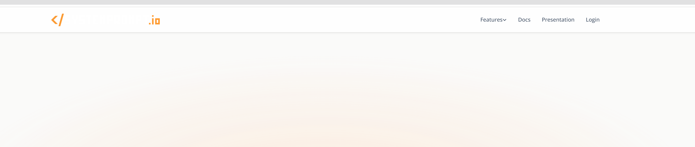
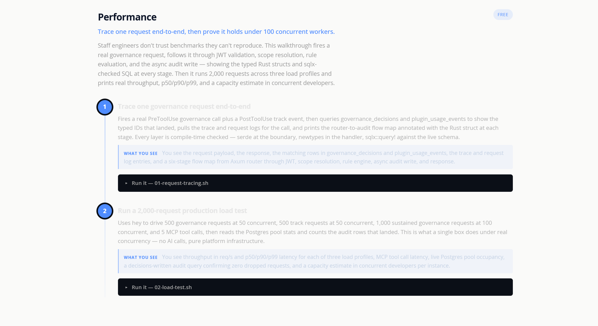

<div align="center">

<picture>
  <source media="(prefers-color-scheme: dark)" srcset="https://systemprompt.io/files/images/logo.svg">
  <source media="(prefers-color-scheme: light)" srcset="https://systemprompt.io/files/images/logo-dark.svg">
  
</picture>

# systemprompt.io — Local Evaluation

### Own how your organization uses AI. Clone it, run it, govern it.


[](https://github.com/systempromptio/systemprompt-core)
[](LICENSE)
[](https://github.com/systempromptio/systemprompt-core/blob/main/LICENSE)
[](https://www.rust-lang.org/)
[](https://www.postgresql.org/)
[](https://systemprompt.io)
[](https://systemprompt.io)
[](https://modelcontextprotocol.io)
[](https://discord.gg/wkAbSuPWpr)

[**Website**](https://systemprompt.io) · [**Documentation**](https://systemprompt.io/documentation/) · [**Discord**](https://discord.gg/wkAbSuPWpr) · [**Book a meeting**](https://systemprompt.io/contact)

</div>

---

## What this is

This is the **local evaluation** for [systemprompt.io](https://systemprompt.io) — self-hosted AI governance infrastructure that enforces permissions, audits every agent action, and manages secrets in a single 50 MB Rust binary with PostgreSQL as its only dependency.

- **Local and self-contained.** Clone the repo, bring your own AI provider key, run the whole stack on your machine. No telemetry. No cloud dependency.
- **Every pillar, end-to-end.** Governance pipeline, secrets management, MCP governance, audit trail, skill marketplace, unified control plane — exercised by 40+ scripted demos in `demo/`.
- **Evaluation-licensed.** The template is MIT. The underlying [systemprompt-core](https://github.com/systempromptio/systemprompt-core) library is BSL-1.1 — free for evaluation and non-production use. Production deployment requires a commercial license: [book a meeting](https://systemprompt.io/contact).

---

## Quick Start

**Prerequisites.** Rust 1.75+ · [just](https://just.systems) · Docker · `jq` / `yq` · an Anthropic, OpenAI, or Gemini API key · free ports `8080` and `5432`.

```bash
# 1. Create your own copy from the template
gh repo create my-eval --template systempromptio/systemprompt-template --clone
cd my-eval

# 2. Build the Rust workspace
just build

# 3. Seed a local profile + Postgres (pass only the keys you have)
just setup-local <anthropic_key> <openai_key> <gemini_key>

# 4. Start all services
just start
```

Open **http://localhost:8080** for the dashboard, admin panel, and governance pipeline. Then:

```bash
systemprompt --help                  # discover every command
systemprompt core skills list        # list seeded skills
./demo/governance/01-happy-path.sh   # first governance trace
```

> **Multiple clones?** Each clone gets its own Docker project derived from its path. Run a second clone on different ports: `just setup-local <key> "" "" 8081 5433`.

---

## What you can evaluate

Six product pillars, each backed by a runnable demo in this repo.

### Governance Pipeline



Synchronous four-layer enforcement on **every** tool call: **SCOPE** check → **SECRET** scan → **BLOCK**list → **RATE** limit. Sub-5 ms p50 overhead. Deny reasons are structured and auditable — not just 403s.

**Try it:** `demo/governance/01-happy-path.sh` through `08-*.sh` — approvals, scope denials, rate limits, hook interception.

<br clear="right">

### Secrets Management


Real-time credential detection across AWS, GitHub, JWT, Stripe, database URIs. Server-side encrypted injection at tool-call time — the model never sees raw secrets, and leaks are blocked before they leave the process.

**Try it:** `demo/governance/06-secret-breach.sh` — fire a request that would exfiltrate a credential; watch the pipeline drop it.

<br clear="right">

### Audit Trail & SIEM



Every request produces a five-point trace: **Identity → Agent Context → Permissions → Tool Execution → Result**. Structured, queryable, SIEM-ready. Four years of audit retention is one `ALTER TABLE` away.

**Try it:** `demo/agents/04-tracing.sh`, `demo/analytics/*.sh` — full request/response traces, cost attribution, conversation reconstruction.

<br clear="right">

### MCP Governance



Central MCP registry with per-server OAuth2, scoped tool exposure, and governed tool calls. Connect Claude Code, Claude Desktop, or any MCP client — permissions follow the user, not the client.

**Try it:** `demo/mcp/*.sh` — register a server, trace a tool call end-to-end, inspect access logs.

<br clear="right">

### Skill Marketplace


Curated, forkable skills distributed by role and department. Slash-command activation inside Claude Code. Cross-session persistence. Edit skills in the admin UI or sync them from YAML.

**Try it:** `demo/skills/*.sh` — list, create, fork, and distribute skills; inspect the plugin manifest pipeline.

<br clear="right">

### Unified Control Plane


One `systemprompt` CLI governs local and remote deployments identically. Scriptable, pipe-friendly, agent-executable. The demo scripts in this repo are literally just shell pipelines over the same CLI your production cluster will run.

**Try it:** `demo/infrastructure/*.sh` — services, database, jobs, logs, config — all via the same binary.

<br clear="right">

---

## Admin dashboard

<details>
<summary><b>See the dashboard (2 screenshots)</b></summary>

<br>



<br><br>



</details>

---

## How it's built

One language. One database. One binary. One CLI.

- **Rust workspace** — `core/` is a read-only BSL-1.1 submodule; your code lives in `extensions/`.
- **PostgreSQL 18+** — the only runtime dependency. Air-gap deploys are a `docker run` away.
- **Sub-5 ms governance** — the pipeline is synchronous and in-process, not a sidecar.
- **MCP / A2A / OAuth2 / WebAuthn** — governed at the protocol layer, not bolted on.

```
my-eval/
├── extensions/       # Your Rust code (compile-time extensions)
│   ├── web/          # Web publishing, themes, SSR
│   └── mcp/          # MCP server implementations
├── services/         # Config-only (YAML/Markdown): agents, skills, plugins, AI providers
├── demo/             # 40+ runnable evaluation scripts, 10 categories
├── storage/files/    # Static assets (CSS, JS, images)
├── docs/images/      # README screenshots + feature animations
├── Cargo.toml        # Workspace manifest
├── justfile          # Development commands
└── CLAUDE.md         # AI assistant instructions
```

---

## Commands

| `just` target | Description |
|---|---|
| `just build` | Build the workspace |
| `just setup-local [keys] [http_port] [pg_port]` | Seed local profile, start Docker Postgres, run publish pipeline |
| `just start` | Start all services |
| `just publish` | Compile templates, bundle CSS/JS, copy assets |
| `just db-up` / `db-down` / `db-reset` | Manage the local Postgres container |
| `just clippy` | Lint the workspace (pedantic, deny-all) |

### `systemprompt` CLI cheatsheet

| Domain | Purpose |
|---|---|
| `core` | Skills, content, files, contexts, plugins, hooks, artifacts |
| `infra` | Services, database, jobs, logs |
| `admin` | Users, agents, config, setup, session |
| `cloud` | Auth, deploy, sync, secrets, tenant, domain |
| `analytics` | Overview, conversations, agents, tools, requests, sessions, content, traffic, costs |
| `web` | Content-types, templates, assets, sitemap, validate |
| `plugins` | Extensions, MCP servers, capabilities |
| `build` | Build core workspace and MCP extensions |

Every command is discoverable — `systemprompt <domain> --help` everywhere.

---

## Demo index

The [`demo/`](demo/) directory is 40+ executable evaluation scripts across ten categories. Each script is numbered — run them in order.

| Category | Scripts | Exercises |
|---|---|---|
| [`demo/governance/`](demo/governance/) | 8 | Tool-call approvals, denials, secret breach, rate limits, hooks |
| [`demo/agents/`](demo/agents/) | 5 | Agent lifecycle, config, messaging, tracing, A2A registry |
| [`demo/mcp/`](demo/mcp/) | 3 | MCP servers, access tracking, tool execution |
| [`demo/skills/`](demo/skills/) | 5 | Skills, content, files, plugins, contexts |
| [`demo/infrastructure/`](demo/infrastructure/) | 5 | Services, database, jobs, logs, config |
| [`demo/analytics/`](demo/analytics/) | 8 | Overview, agents, costs, requests, sessions, content/traffic, conversations, tools |
| [`demo/users/`](demo/users/) | 4 | User CRUD, roles, sessions, IP bans |
| [`demo/web/`](demo/web/) | 2 | Content types, templates, sitemaps, validation |
| [`demo/cloud/`](demo/cloud/) | 1 | Auth, profiles, deployment info |
| [`demo/performance/`](demo/performance/) | 2 | Request tracing, benchmarks, load testing |

See [`demo/README.md`](demo/README.md) for the full catalogue and [`demo/AGENTS.md`](demo/AGENTS.md) for the LLM-targeted runbook.

---

## License & production use

**This template** is MIT licensed. Fork it, modify it, use it however you like — **for local evaluation**.

**[systemprompt-core](https://github.com/systempromptio/systemprompt-core)** (the underlying library) is [BSL-1.1](https://github.com/systempromptio/systemprompt-core/blob/main/LICENSE): free for evaluation, testing, and non-production use. **Production use requires a commercial license.** Each version converts to Apache 2.0 four years after publication.

**Ready to deploy to production?** [Book a meeting](https://systemprompt.io/contact) · [ed@systemprompt.io](mailto:ed@systemprompt.io)

---

<div align="center">

**[systemprompt.io](https://systemprompt.io)** · **[systemprompt-core](https://github.com/systempromptio/systemprompt-core)** · **[Documentation](https://systemprompt.io/documentation/)** · **[Discord](https://discord.gg/wkAbSuPWpr)** · **[Contact](https://systemprompt.io/contact)**

<sub>Own how your organization uses AI. Every interaction governed and provable.</sub>

</div>
