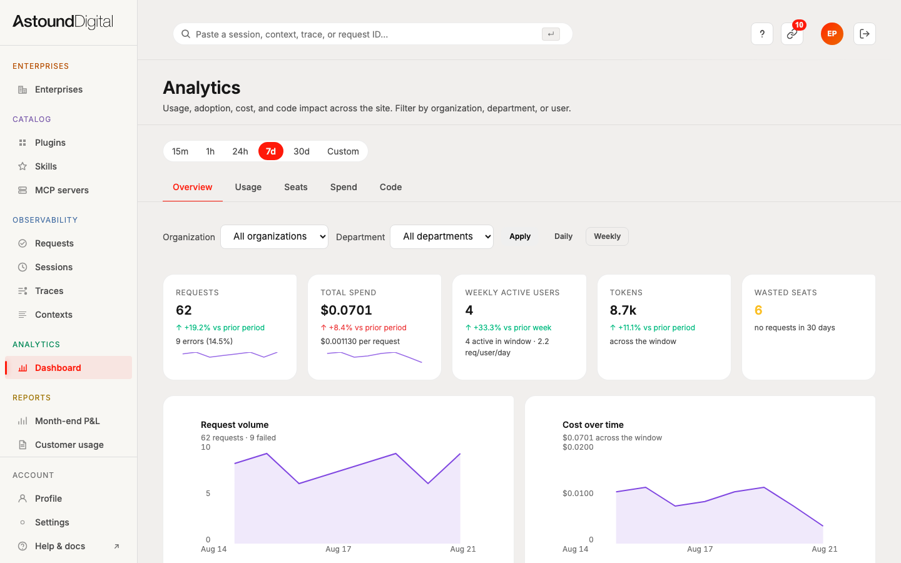
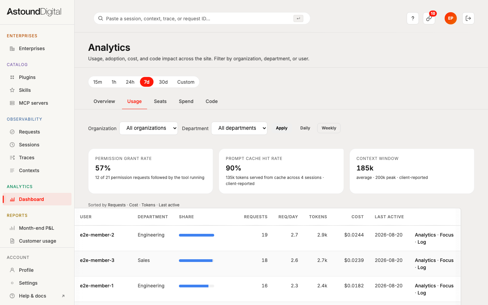
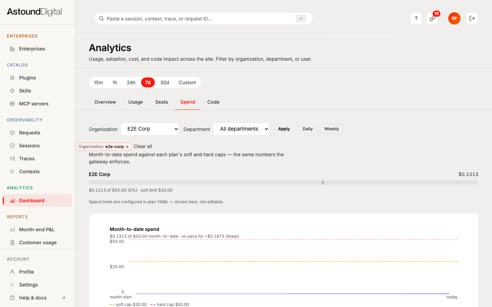
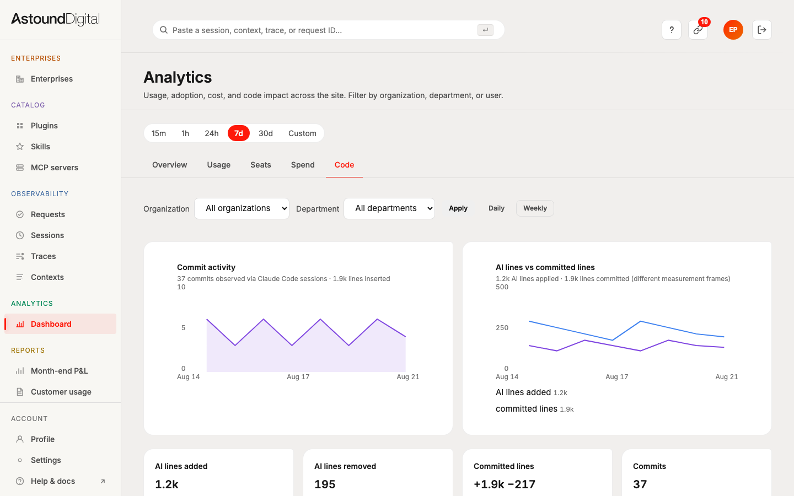
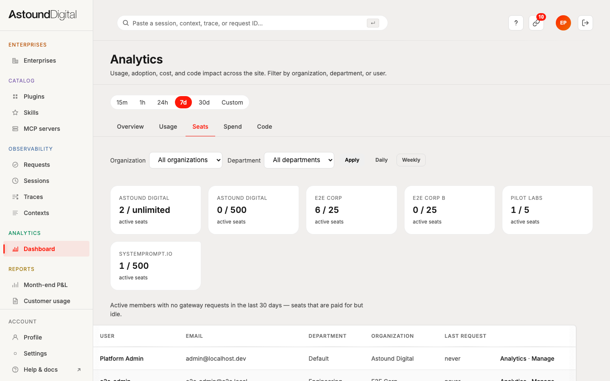
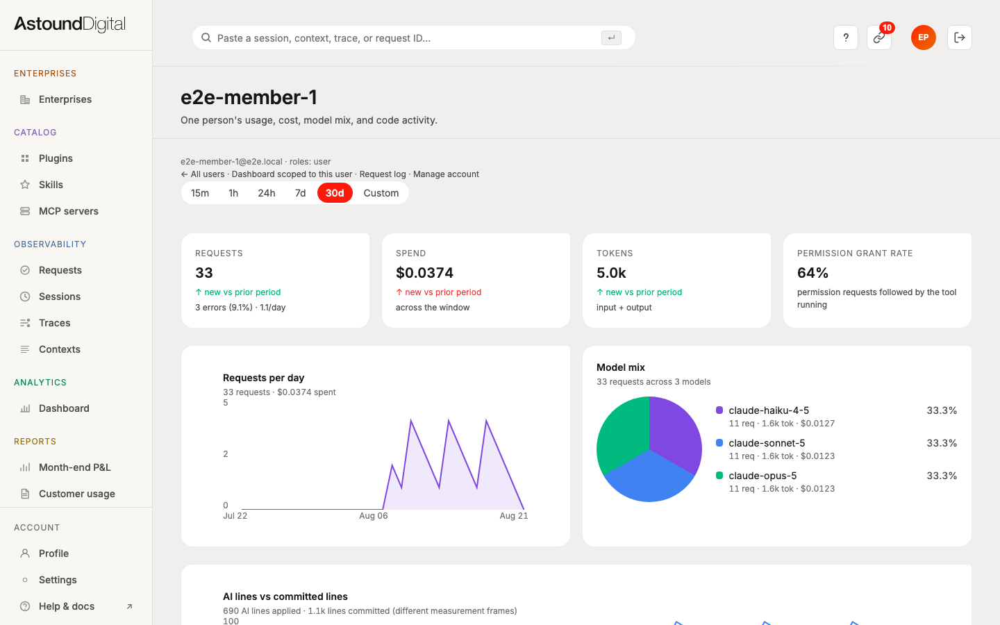
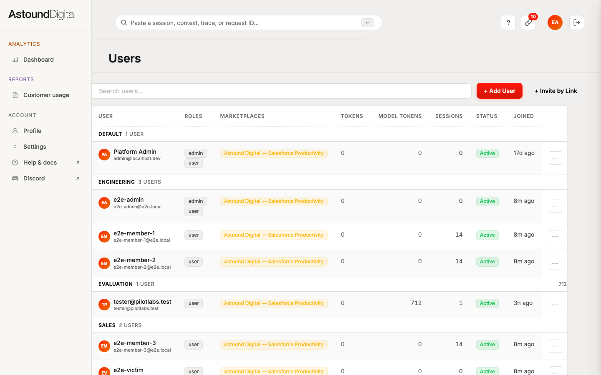
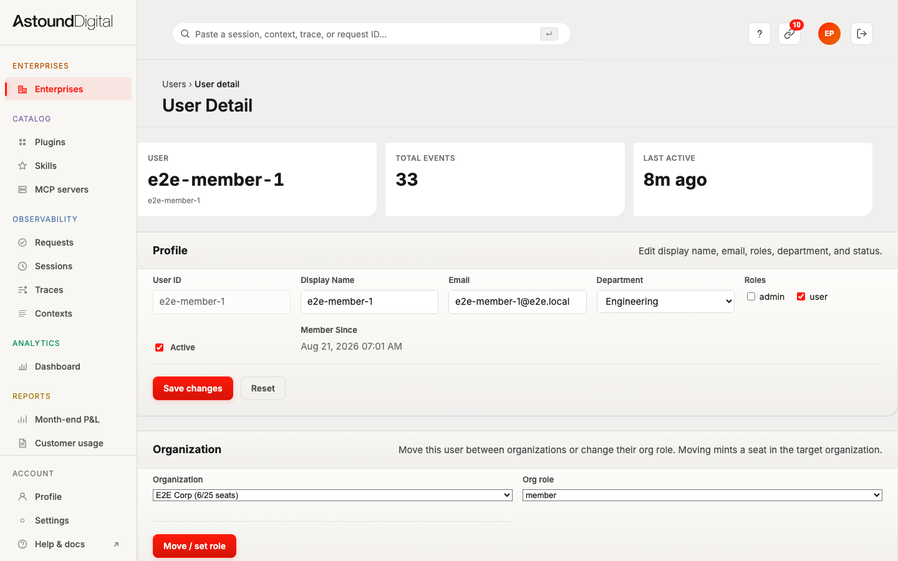
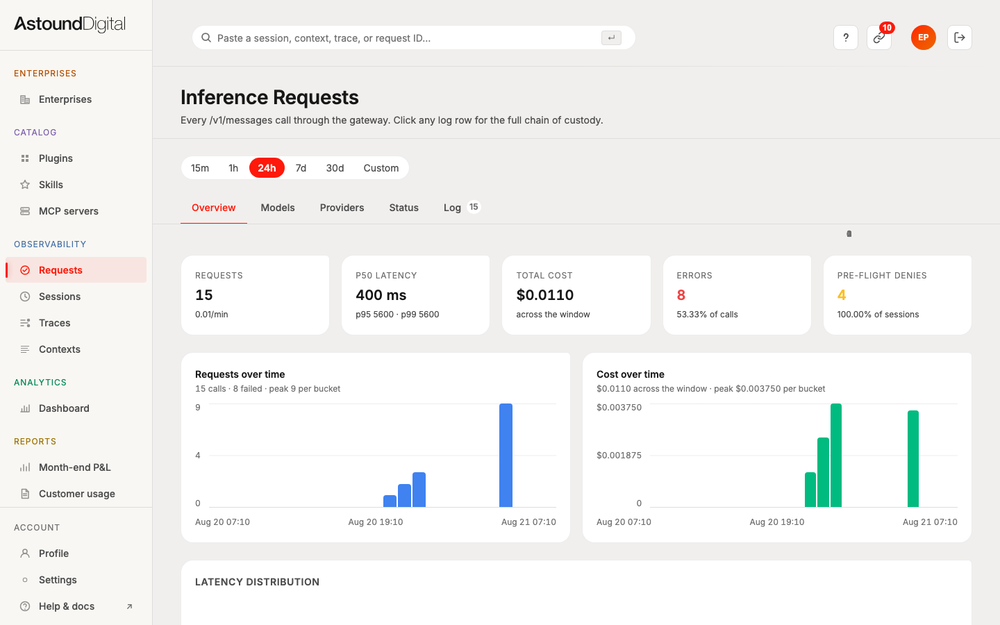

# Admin platform hardening — status update

**Branch:** `main` (working tree) · **Date:** 21 Aug 2026

Four workstreams landed together: governance/robustness fixes from an
architecture review, user management completed in the admin site, the analytics
dashboard built out, and a real authenticated browser test suite.

---

## TL;DR

- **41/41 browser tests pass**, including the full invite → passkey → signed-in
  journey driven through a virtual authenticator.
- **359/359 unit tests pass**; build, clippy and all 23 lint gates green.
- **Six real bugs** were found by the browser tests that no unit or contract
  test would have caught — details below.
- Analytics dashboard now has trend lines, period-over-period deltas,
  sparklines, cost-by-model, a spend burn-up against caps, and a per-user
  drill-down page. All charts are server-rendered SVG — no JS chart library.

---

## Screenshots

All captured from the running app against seeded data
(`docs/screenshots-2026-08-21/`).

### Analytics — Overview
KPI cards with period-over-period deltas and sparklines; request-volume and
cost trend lines.

### Analytics — Usage
Permission-grant rate, prompt-cache hit rate and context-window pressure
(client-reported, labelled as such), plus the top-users leaderboard with
per-user drill-down links.

### Analytics — Spend
Month-to-date burn-up against the plan's soft (amber) and hard (red) caps, with
an honest linear pace projection, plus the fast/slow latency split and the
soft-cap crossing history.

### Analytics — Code
Commit activity and AI-lines-vs-committed-lines, with the two measurement
frames kept separate and never subtracted from one another.

### Analytics — Seats
Seat utilisation and the wasted-seat table (no requests in 30 days).

### Per-user drill-down (new page)
`/admin/analytics/users/{id}` — one person's usage, cost, model mix and code
activity, with links back to the request log and their management page.

### Users roster
Department-grouped roster with both provisioning doors: direct create and
invite-by-link.

### User detail
Roles are now a validated checkbox set (was free-text), and the organization
widget preselects the user's actual org.

### Request log
Existing page, unchanged — included for context.

---

## What changed

### A. Robustness fixes (from the architecture review)

| Fix | Why it mattered |
|---|---|
| Marketplace ACL cache keyed **per database** | Same bug class as the authz-registry fix one file over: a process-wide cache served one database's authorization rules to another. TTL also cut 5 min → 30 s, matching how fresh the data below it is. |
| Governance audit write is now **awaited** before responding | This plane's whole product is the audit row; it was fire-and-forget and could be lost. |
| Secret-breach KPI uses `policy = 'secret_scan'` | Was string-matching a rendered message — a wording change would have silently zeroed the metric. |
| Trace-list pagination **pushdown** | Expensive per-session work now runs for the selected page only, not every session in the window. |
| Composite indexes for the analytics query shapes | Migration `029`. |
| Deleted an orphaned copy of core's policy engine | Undeclared module that would have drifted. |

### B. User management in the admin site

- Department now actually persists on create (it was silently dropped — the
  API had no field for it at all).
- "+ Add User" returns a **7-day sign-in link**; previously it created accounts
  with no credential whatsoever.
- Lost invite links are recoverable via **regenerate** (revoke + re-mint in one
  transaction) — the raw token is shown exactly once by design.
- Roles are a validated checkbox set instead of a free-text field.
- Org admins can manage their own members' roles (member ↔ admin) — never
  `owner`, never across organizations.
- Guarded hard-delete surfaced in the roster (the endpoint was always one curl
  away; hiding it was not a control).

### C. Analytics build-out

Server-rendered SVG throughout — all geometry computed in Rust, no client
charting library, no CDN.

- Line + area trend charts, sparklines on KPI cards, stacked cost-by-model.
- Period-over-period deltas from a **single two-window query**, so both windows
  read one snapshot.
- Spend tab: MTD burn-up vs caps, soft-cap crossing history (that table was
  being written but never read), latency-bucketed fast/slow split.
- New per-user drill-down page.
- Cache-hit rate and context-window pressure surfaced from session snapshots
  that were previously captured and never read.

**On the Cursor-style metrics:** "tab acceptance rate" and fast/slow *pools*
don't exist on this platform — there's no editor accept/reject signal and no
request-pool concept. Rather than fabricate them, the dashboard shows the
nearest real thing, labelled honestly: permission-grant rate, AI lines vs
committed lines (different measurement frames, never subtracted), and a latency
split at a fixed 5 s threshold that matches the request log's histogram bin.

### D. Browser test suite

- Auth fixtures mint real JWTs and attach them as session cookies; three
  principals (org admin, platform admin, plain user) plus anonymous.
- Deterministic seed: orgs, departments, principals and a 14-day analytics
  trail, all `e2e-`-prefixed and idempotent — it never touches developer data.
- Specs cover auth boundaries, all five analytics tabs, filters, sorting,
  pagination, empty states, the roster, invites, org membership, and the full
  passkey invite journey.
- `just e2e-seed`, `just e2e`, `just e2e-screens` recipes.

---

## Bugs the browser tests caught

None of these were visible to unit or contract tests.

1. **Session attestation** — core replaces a cookie that doesn't name a session
   it issued *to that user* with an **anonymous** token. Tokens were being
   silently downgraded mid-redirect; found by tracing the cookie across the
   redirect chain.
2. **Duplicate invite returned 500 instead of 409** — `MarketplaceError::Conflict`
   had no status mapping, so a normal "already invited" case looked like a
   server fault.
3. **Org widget didn't preselect the user's current organization** — it showed
   whichever org sorted first, which reads as though the user had been moved.
4. **Playwright `storageState` is file-scoped** — the first fixture design
   silently ran every spec anonymous while appearing to pass.
5. **Commit chart flattened its own series** — commits (37) plotted against
   inserted lines (1.9k) on one axis pinned commits to the baseline.
6. **Convention breaches in new front-end code** — a non-existent CSS class,
   plus banned JS/CSS comments and token fallbacks.

---

## Where it stands

| Gate | Result |
|---|---|
| Build | pass |
| Clippy + 23 lint gates | pass |
| Unit (359 tests) | pass |
| Browser e2e (41 tests) | pass |
| Integration | running |
| Contract | pending (needs a deliberate baseline re-record for the new routes) |

**Not done / deliberately out of scope:** spend caps and org economics stay
YAML-authored (surfaced read-only, not editable); no invite email delivery
(link hand-off by design); CSV export deferred. Governance stages remain
disabled per the documented operator decision — this work hardened the
machinery and its audit spine without changing that posture.

Pre-existing issues found along the way are written up separately in
`issue.md`, including the ones that need a core release to fix.
