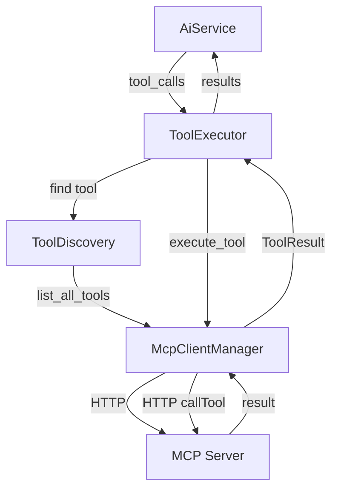

# MCP Tool Execution Module

Execute MCP (Model Context Protocol) tools during AI conversations and agentic workflows.

## Purpose

This module provides runtime tool execution capabilities for AI services. When an LLM decides to use a tool during a conversation, this module:
- Connects to running MCP servers
- Discovers available tools from those servers
- Executes tool calls from LLM responses
- Returns execution results back to the LLM
- Tracks execution metrics and logs

## Critical Distinction: AI MCP vs Agent MCP

SystemPrompt has **TWO separate MCP modules** with different purposes:

| Module | Purpose | Output | When Used |
|--------|---------|--------|-----------|
| **AI MCP** (this) | Execute tools during AI conversations | `ToolResult` (execution results) | Runtime during agentic loops |
| **Agent MCP** (`agent/services/external_integrations/mcp`) | Load tools as agent capabilities | `AgentSkill` (capability metadata) | Discovery/startup time |

**AI MCP**: "Run this tool NOW and give me the result"
**Agent MCP**: "What tools does this agent have available?"

## Architecture

```
AI Conversation Flow:
1. User message → AiService
2. LLM generates tool calls
3. ToolExecutor executes via McpClientManager
4. Results returned to LLM
5. LLM continues conversation with tool results
```

## Components

### `McpClientManager` (client.rs - 222 lines)
**Purpose**: Connection pooling and management for MCP services

Maintains persistent connections to MCP servers and handles service lifecycle.

**Key Methods**:
- `connect_to_service(service)` - Establish connection to MCP server
- `disconnect_from_service(service_id)` - Close connection
- `list_all_tools()` - Get all tools from connected services
- `execute_tool(tool_call, service_id, ...)` - Execute single tool call
- `refresh_connections()` - Refresh all active connections
- `refresh_connections_for_agent(agent_id)` - Refresh agent-specific connections
- `health_check()` - Validate all connections

**Connection Management**:
```rust
pub struct McpClientManager {
    services: Arc<RwLock<HashMap<String, ServiceConnection>>>,
    app_context: Arc<AppContext>,
}
```

Maintains a thread-safe registry of active MCP service connections with validation state.

### `ToolDiscovery` (tool_discovery.rs - 46 lines)
**Purpose**: Discover and filter available tools from connected MCP servers

Provides query interface over the tool catalog.

**Key Methods**:
- `discover_all_tools()` - Get all available tools
- `discover_tools_for_agent(agent_id)` - Get agent-specific tools
- `discover_tools_for_service(service_id)` - Get service-specific tools
- `find_tool_by_name(tool_name)` - Lookup specific tool
- `get_tools_matching_pattern(pattern)` - Pattern-based search

**Usage**:
```rust
let discovery = ToolDiscovery::new(mcp_client_manager);
let tool = discovery.find_tool_by_name("database_query").await?;
```

### `ToolExecutor` (tool_executor.rs - 113 lines)
**Purpose**: Execute tools with logging, metrics, and error handling

Orchestrates tool execution with comprehensive observability.

**Key Methods**:
- `execute_tool_call(tool_call, request_id, sequence, ...)` - Execute single tool
- `execute_multiple_tools(tool_calls, request_id, ...)` - Batch execution

**Features**:
- Execution timing/metrics
- Comprehensive logging (start, success, error)
- Error recovery (failed tools don't crash execution)
- Unique execution IDs for traceability
- Context and task ID propagation

**Execution Flow**:
```rust
pub async fn execute_tool_call(
    &self,
    tool_call: &ToolCall,      // From LLM response
    request_id: &str,          // AI request ID
    sequence: i32,             // Order in batch
    context_id: Option<String>, // Conversation context
    task_id: Option<String>,   // A2A task ID
) -> Result<ToolResult>
```

## Data Flow



## Usage Examples

### Basic Setup (from AiService)
```rust
use std::sync::Arc;
use crate::services::mcp::{McpClientManager, ToolDiscovery, ToolExecutor};

// Initialize components
let mcp_client_manager = Arc::new(McpClientManager::new(app_context.clone()));
let tool_discovery = Arc::new(ToolDiscovery::new(mcp_client_manager.clone()));
let tool_executor = Arc::new(ToolExecutor::new(
    mcp_client_manager,
    tool_discovery,
    logger.clone(),
));
```

### Execute Tool During AI Conversation
```rust
// LLM generated tool call
let tool_call = ToolCall {
    id: "call_123".to_string(),
    name: "database_query".to_string(),
    arguments: json!({"table": "users", "limit": 10}),
};

// Execute tool
let result = tool_executor.execute_tool_call(
    &tool_call,
    "request_abc",  // AI request ID
    1,              // First tool in sequence
    Some("session_xyz".to_string()),
    None,
).await?;

// Result returned to LLM
assert!(!result.is_error);
println!("Tool output: {}", result.content);
```

### Batch Tool Execution
```rust
let tool_calls = vec![
    ToolCall { name: "get_weather".to_string(), ... },
    ToolCall { name: "send_email".to_string(), ... },
];

let results = tool_executor.execute_multiple_tools(
    tool_calls,
    "request_def",
    Some("session_xyz".to_string()),
    None,
).await?;

// All results returned, even if some failed
for result in results {
    if result.is_error {
        eprintln!("Tool {} failed", result.call_id);
    }
}
```

### Connection Management
```rust
// Refresh connections before tool use
mcp_client_manager.refresh_connections().await?;

// Health check
let health = mcp_client_manager.health_check().await?;
for (service_id, is_healthy) in health {
    println!("Service {}: {}", service_id, if is_healthy { "OK" } else { "DOWN" });
}
```

## Integration Points

This module is used by:

### `AiService` (services/core/ai_service.rs)
Main AI orchestration service uses this for tool-enabled conversations:
```rust
pub struct AiService {
    mcp_client_manager: Arc<McpClientManager>,
    tool_discovery: Arc<ToolDiscovery>,
    tool_executor: Arc<ToolExecutor>,
    // ...
}
```

### `AgenticExecutor` (services/core/agentic_executor.rs)
Multi-turn autonomous execution loops use this for tool execution:
```rust
pub async fn execute_loop(
    &self,
    provider: &dyn AiProvider,
    initial_messages: Vec<AiMessage>,
    tools: Vec<McpTool>,  // From ToolDiscovery
    // ...
) -> Result<AgenticExecutionResult>
```

## Error Handling

**Connection Errors**:
- Service not found → Error propagated
- Connection timeout → Error with timeout message
- Service not running → Error with status

**Execution Errors**:
- Tool not found → Error propagated
- Execution failure → `ToolResult` with `is_error: true`
- Batch execution → Individual failures don't stop batch

**Resilience**:
```rust
// Failed tools return error results, don't crash
results.push(ToolResult {
    call_id: tool_call.id.clone(),
    content: json!({"error": e.to_string()}),
    is_error: true,
});
```

## Logging

All operations produce structured logs:

**Tool Execution Start**:
```
Executing tool database_query: query_users for request req_123
(execution_id: exec_456, sequence: 1, context: session_xyz)
```

**Tool Execution Success**:
```
Tool database_query completed: 1234 chars in 45ms (execution_id: exec_456)
```

**Tool Execution Failure**:
```
Tool database_query failed after 120ms: Connection refused (execution_id: exec_456)
```

## Performance Considerations

- **Connection Pooling**: Maintains persistent connections (no reconnect overhead)
- **Parallel Execution**: `execute_multiple_tools` runs sequentially (intentional for now)
- **Timeout Protection**: No timeout on individual tool calls (relies on MCP client timeout)
- **Health Checks**: Validates connections on demand, not continuously

## Configuration

No direct configuration. Depends on:
- **Services Table**: MCP servers must be registered with `protocol='mcp'`
- **Agent Metadata**: Agent's `mcp_servers` JSON array assigns servers to agents
- **MCP Server Availability**: Servers must be running and accessible

## Future Enhancements

Potential improvements:
- [ ] Parallel tool execution for `execute_multiple_tools`
- [ ] Configurable timeouts per tool
- [ ] Tool result caching
- [ ] Connection pool size limits
- [ ] Automatic reconnection on connection loss
- [ ] Tool execution rate limiting

## Related Modules

- `services/core/ai_service.rs` - Main AI orchestration
- `services/core/agentic_executor.rs` - Agentic loops
- `models/tools.rs` - Tool type definitions
- `systemprompt_core_mcp` - Core MCP client library
- `agent/services/external_integrations/mcp` - Agent skill loading (different purpose!)
