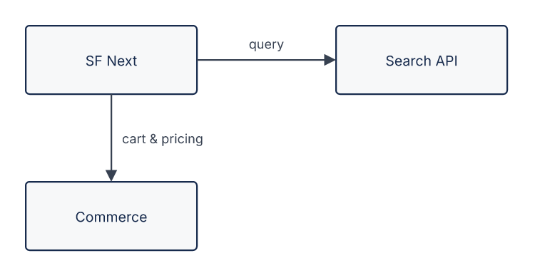
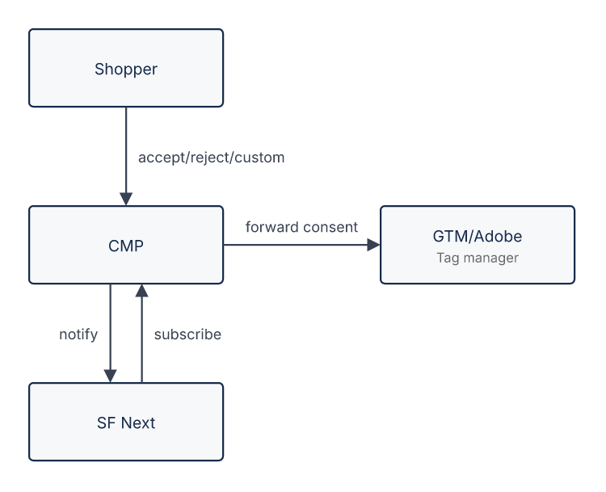
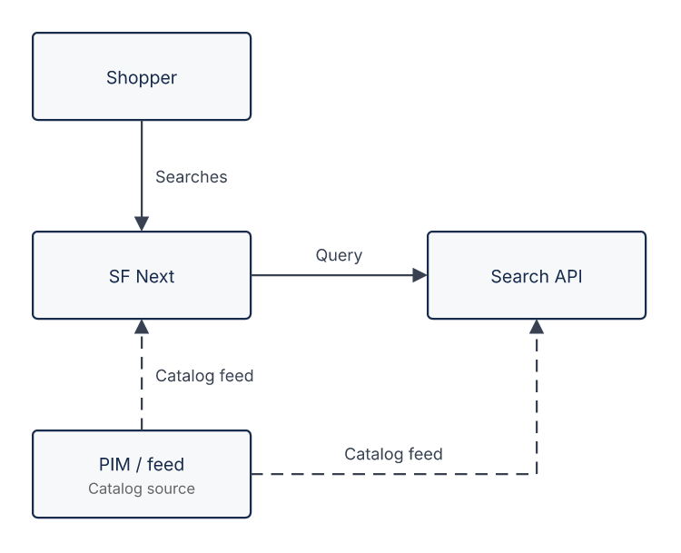

# Flow diagram — authoring reference

The cross-type authoring rules (audience, high-level/collapse, conciseness, scope,
reading order) live in the skill's **Authoring philosophy** — read that first. This reference
adds only what is specific to `flow`, in the standard CONCEPT -> CONTRACT shape.

## CONCEPT

**Overview.** A flow diagram is a general **boxes-and-arrows** picture: components (or steps) as
boxes with labelled arrows, plus optional decision diamonds. It uses a **manual grid** — you pick
each node's row (and optionally column); the generator computes every pixel, routes the arrows,
and spreads parallel arrows so nothing overlaps.

**Mental model — a manual grid.** Rows stack top->bottom (every node declares its `row`); a node's
column is its **position within its row** (first listed = col 0, next = col 1, …), so the
first-listed node in each row lines up into a vertical **spine**. Boxes are a fixed, uniform size, and
which side each arrow leaves and enters, how it routes and how parallel arrows fan out are all
*derived* from where the nodes sit — you place no pixels. That makes **placement your only lever** on
a readable picture, so read **Layout: mechanics and UX** below before writing the spec.

**Pick me when** the story is *structure or logic* rather than a timed exchange — components and
how they connect, or a process with steps and decisions. Two shapes, same `flow` type:

- **Activity** — the process has genuine branching: use `kind: decision` diamonds with the real
  condition on each branch arrow.
- **Plain** — just "who connects to whom", no decisions: plain boxes and labelled edges.

Add decisions only when the context has a real choice; don't invent them to look richer. Keep one
box per step: fold an action and its acknowledgement (do-and-confirm, request-and-ready) into a
single node — a separate "confirm" step adds no scope. If the point is ordered call/return over
time, use `sequence`.

**Scope stance.** Third-party systems sit in a side column, off the main spine of nodes we build,
and stay in the picture as something we connect to. Position carries the boundary — the reader
sees what we build and what we consume without it being woven into the centre.

## CONTRACT

### Format

Author inline with a ` ```drawio:flow:<id> ` block: the header carries the `type` (`flow`) and the
`id`; the body is the **scenario only** — no `type:`/`id:` keys. Add the ``
line yourself after the block; on publish the block is stripped. Quote every human-readable string
value (`text`, `title`, `subtitle`) — the compact one-line `{ … }` style is comma-sensitive.

### Vocabulary

`nodes` — the boxes (and decisions):

| field | required | budget | meaning |
| --- | --- | --- | --- |
| `id` | yes | — | stable key referenced by `edges` |
| `row` | yes | int >= 0 | which band the node sits in (top to bottom) |
| `col` | no | int >= 0 | explicit column override (default = index within the row) |
| `kind` | no | — | `box` (default, rounded rectangle) or `decision` (bare rhombus, carries no text) |
| `title` | rec. (boxes) | <= 16 chars | primary bold label (defaults to `id`); ignored on a `decision` |
| `subtitle` | no (boxes) | <= 18 chars | grey second line — role/detail; ignored on a `decision` |

A `decision` is an empty diamond — the question and its outcomes live entirely on the branch
arrows; a bare `yes`/`no` does not work, so write the real condition on each branch. Flow has no
actor or lifeline concept (that is `sequence`) — an initiator like a shopper is an ordinary `box`;
`kind` is only `box` or `decision`.

`edges` — the arrows:

| field | required | budget | meaning |
| --- | --- | --- | --- |
| `from` | yes | — | source node id |
| `to` | yes | — | target node id (must differ from `from` — no self-loops) |
| `text` | no (**required** on a decision branch) | <= 28/line, wraps to 2 (<= 56) | label placed beside the arrow |
| `type` | no | — | `sync` (default, solid) or `async` (dashed) — see below |

Direction and the side each arrow attaches to are derived from the grid; a `decision`'s branches
leave its left/right vertices by column so they fan out cleanly.

**How a branch label is read.** The generator draws the diamond **empty** — it renders no `title`,
no question, nothing but the shape. So a reader arriving at the fork sees only the two branch
`text`s, side by side, with no question in view to answer. Each label is therefore read *on its
own*, and only carries meaning if it states the **case it covers** in full: `"Cache hit"` tells the
reader everything, `"yes"` answers a question that was never drawn. Write the condition itself and
the diagram needs no legend — `"Under quota"` / `"Over quota"`, `"Valid token"` / `"Expired"`. The
same reasoning covers every edge: the arrow shows direction, the `text` says what crosses it, so
name the action or data that moves (`"Enqueue job"`, `"Job ID"`), which a bare `"go"` or `"data"`
never does.

**Sync vs async edges.** A plain edge is a **synchronous** relationship — a request/response, a
navigation, a direct dependency — drawn solid. Mark an edge `type: async` when it is **out-of-band,
background work** that is not part of the synchronous chain: a scheduled feed, a batch ingest, an
event. It renders dashed. Reach for `async` **sparingly** — only when that background relationship
is important logic worth showing (most often *where the data comes from*); if nothing meaningful is
lost, leave it out. A **pure async source** — a node whose only edges are outgoing `async` (a feed
publishing into the systems that consume it) — is a legitimate standalone origin on the picture
(see F7); it lets the reader see the data source without pretending it is part of the live flow.

### Layout: mechanics and UX

The first half below is the **mechanics** — exactly how each line of the spec becomes geometry. Learn
it well enough to predict the render in your head. The second half is the **UX practice** that
follows from that mechanics; every rule there is a consequence, not a matter of taste.

#### How the spec becomes the picture

**Placement.** Every node declares `row` (integer, bands stack top->bottom). Its column is either the
explicit `col` or, by default, **its index among the nodes listed in that row** (first = col 0, next
= col 1, …). Nothing else positions a node.

**Slots collapse.** Only the row/col values you actually *use* matter: they are sorted and turned into
consecutive slots. So `col: 5` on a lone node does not open five empty columns — it just means "the
next column"; jumping `row: 0` -> `row: 7` leaves no empty bands either.

**Cells and sizing.** A column is as wide as its widest node, a row as tall as its tallest, and every
node is **centred in its cell**. All boxes are one fixed uniform size — a `subtitle` does not widen a
box; a `decision` diamond is the same width, slightly taller. Two consequences to rely on:

- nodes sharing a `col` align into one **vertical spine** (their centres line up);
- nodes sharing a `row` sit on one **horizontal line**.

**Gaps are the arrow corridors.** Between neighbouring columns and rows the generator leaves a fixed
empty gap, sized to hold an arrow plus its label. **Every arrow travels through those gaps** — so a
line only stays clean if the corridor it needs is free of boxes.

**Text.** `title` and `subtitle` are centred inside the box. Because the box is fixed, the budgets are
hard caps: `title` <= 16 chars, `subtitle` <= 18, an edge label <= 28 per line, wrapping onto at most
2 lines (<= 56). Widths come from a character-count heuristic, never real glyph metrics, so the same
spec renders identically everywhere.

**Sides are derived, not authored.** You never say where an arrow attaches; the grid delta decides:

| source vs target | leaves the source | enters the target | shape |
| --- | --- | --- | --- |
| same column, target below | bottom | top | straight vertical |
| same column, target above | top | bottom | straight vertical |
| same row, target to the right | right | left | straight horizontal |
| same row, target to the left | left | right | straight horizontal |
| different row **and** column | the side facing the target's column | its **top** if it sits below, its **bottom** if the arrow comes from below | one L-bend |

A `decision` is the exception on the source end: its branches leave the **left/right vertex** by
column delta (or the bottom/top tip when a branch runs straight down/up), so they fan out.

**Route shape.** From those sides the path follows mechanically: aligned ends -> a straight line;
mixed axes -> a single **L-bend** whose horizontal leg runs **along the source's row** before turning
vertically into the target's top or bottom; two ends on the same axis but not aligned -> a **Z** with
a mid-run between them. That "horizontal leg along the source's row" is where most layout mistakes
come from.

**Parallel arrows and labels.** Several arrows leaving or entering the same side of a node are spread
into parallel lanes, ordered by the position of their far endpoint, so they fan out without crossing
each other. A label then sits beside its line at a constant gap: on an **L-bend** it pins to the leg
leaving the source (which is what keeps a decision's two branch labels apart), on a **Z** to the
middle run, and on a straight vertical pair the left arrow's label goes left, the right one's right.

**Async.** `type: async` only switches the stroke to dashed — it changes neither placement nor
routing.

**The causal chain**, which is the whole model in one line:

`row`/`col` -> cell centres -> which **sides** the arrow uses -> which **route** (straight / L / Z) ->
which **gap** the line runs through -> whether some third box happens to sit in that corridor (**F8**)
and whether labels collide.

Sides, routes and lanes are all computed, so **placement is your only lever**: a clean picture is won
or lost purely by where you put the nodes.

#### UX best practices

1. **Choose the spine first.** Run the main story down `col 0`, top->bottom: actor -> our system ->
   the primary backend or next step. *Because* a shared `col` centres into one vertical line, the
   reader gets a single chain to follow. But **only one path continues that spine**: where a node
   forks — a `decision`, or any node with two forward targets — the first outcome stays on `col 0`
   and the others move to a side column on their own row (see rule 3). The forks are *parallel*, not
   the next steps stacked underneath; stack them in `col 0` and the arrow to the farther one crosses
   the nearer (**F8**).
2. **Put a side system beside the node that calls it** — same `row` as its caller, next column.
   *Because* same row + different column gives a short straight horizontal arrow, and position is what
   marks third-party scope. A system used more than once stays **one node**: draw the exchange once
   (a request/response pair on its row reads fine), never a second arrow reaching back to it from a
   step further down — that back-leg runs across the rows between and cuts through a box (**F8**).
3. **Fan a node's several targets onto different axes.** One target continues down the spine, the
   other goes to a side column. *Because* a far target collinear with the source sends the arrow
   straight through whatever sits between them (**F8**).
4. **Keep the source's row clear out to the target's column.** A bending arrow's horizontal leg
   travels along the **source's row**, so nothing may sit in that row between the source and the
   target's column. In particular, **never stack a second target underneath a side node**: reaching it
   runs the leg along the caller's row and straight through that side node.
5. **Put feeds and data sources at the far end, below what they feed.** *Because* a target is entered
   by row — on its **bottom** when the source sits below it — an upward feed lands cleanly on the
   bottom edge. A source placed at the top has to travel back down across the whole spine and will
   cross it.
6. **Keep labels to short verb phrases** ("query", "cart & pricing", "catalog feed"). *Because* labels
   live inside the fixed gap, long text crowds the corridor.
7. **Don't run two long arrows side by side** (two dashed feeds over the same span, say) — their
   labels stack and read as clutter. Give them different rows, or opposite sides.
8. **Keep the grid as small as the story needs — reuse the columns and rows you already have.**
   Every distinct `col` value adds a whole column band to the picture's width (and every distinct
   `row` a band of height), whether or not you meant to. So put a later node in an EXISTING column
   when the geometry allows: a branch outcome can share the column of the side system a row above,
   which both narrows the diagram and lines the two up vertically. Do not "reserve" space by
   skipping values — `col: 3` next to a lone `col: 0` does not leave two empty columns, it simply
   means the next one, so a skipped number only misleads the reader of the spec.

**Recipe — a hub with two targets.** The most common shape: a caller, a side system on its row, and
the next step continuing down the spine.

```yaml
nodes:
  - { id: shopper, row: 0, col: 0, title: "Shopper" }
  - { id: sfnext,  row: 1, col: 0, title: "SF Next" }                      # spine
  - { id: search,  row: 1, col: 1, title: "Search API" }                   # side system, caller's row
  - { id: sfcc,    row: 2, col: 0, title: "SFCC", subtitle: "Commerce" }   # spine continues
edges:
  - { from: shopper, to: sfnext, text: "search / browse" }
  - { from: sfnext,  to: search, text: "query" }             # short horizontal, nothing between
  - { from: sfnext,  to: sfcc,   text: "cart & pricing" }    # straight down the spine
```

Why it works: `sfnext`'s two targets leave on **different axes** (one right, one down), and its row
holds nothing beyond `search`.

**Recipe — a decision and its two outcomes.** The activity shape, and the one most often drawn
wrong. A decision is just a hub with two targets, so it obeys the same fan-out: the diamond sits on
the spine, **one outcome continues down `col 0`, the other goes to a side column on that outcome's
row**. The two branches then leave on different axes and cross nothing.

```yaml
nodes:
  - { id: check,    row: 0, col: 0, title: "Check" }
  - { id: gate,     row: 1, col: 0, kind: decision }
  - { id: proceed,  row: 2, col: 0, title: "Proceed" }     # one outcome continues the spine
  - { id: fallback, row: 2, col: 1, title: "Fallback" }    # the other fans to a side column, same row
edges:
  - { from: check, to: gate,     text: "result" }
  - { from: gate,  to: proceed,  text: "within limit" }
  - { from: gate,  to: fallback, text: "over limit" }
```

The trap is to read the two outcomes as *the next two steps* and stack them down the spine
(`proceed` at row 2, `fallback` at row 3, both `col 0`). They are not sequential — they are
parallel branches of one fork, so the arrow to the farther one runs straight through the nearer
(**F8**). Give the second outcome its own column.

**Recipe — a feed source.** Attach a background source at the bottom with `async` edges.

```yaml
nodes:
  - { id: shopper, row: 0, col: 0, title: "Shopper" }
  - { id: sfnext,  row: 1, col: 0, title: "SF Next" }
  - { id: search,  row: 1, col: 1, title: "Search API" }
  - { id: sfcc,    row: 2, col: 0, title: "SFCC", subtitle: "Commerce" }
  - { id: pim,     row: 3, col: 0, title: "PIM / feed", subtitle: "Catalog source" }   # far end
edges:
  - { from: shopper, to: sfnext, text: "search / browse" }
  - { from: sfnext,  to: search, text: "query" }
  - { from: sfnext,  to: sfcc,   text: "cart & pricing" }
  - { from: pim,     to: sfcc,   text: "catalog feed", type: async }   # up into sfcc's bottom
  - { from: pim,     to: search, text: "catalog feed", type: async }   # up the side column
```

Why it works: the live request chain still reads top->bottom, and the feed sits below everything it
feeds, so its arrows travel **up** into bottom edges instead of back across the flow.

**Anti-patterns.** Learn to recognise these shapes — all four are rejected by F8:

| anti-pattern | placement | what the geometry does |
| --- | --- | --- |
| three across, the first feeding both | `a(r1,c0) b(r1,c1) c(r1,c2)` with `a->b`, `a->c` | `a->c` runs along row 1 straight through `b` |
| three in a column, the first feeding both (**a decision with both outcomes stacked in col 0** is the usual culprit) | `a(r1,c0) b(r2,c0) c(r3,c0)` with `a->b`, `a->c` | `a->c` runs down col 0 straight through `b` |
| a second target stacked under a side node | `a(r1,c0) b(r1,c1) c(r2,c1)` with `a->b`, `a->c` | `a->c`'s horizontal leg runs along row 1 through `b` |
| a feed at the top | `pim(r0,c1)` feeding `sfnext(r1,c0)` and `sfcc(r2,c0)` | the feed's arrows travel back down across the spine, crossing it |

**Before -> after.** The first anti-pattern, three across with the leftmost feeding both, so `store ->
commerce` is drawn through `Search API`:

```yaml
nodes:
  - { id: store,    row: 0, col: 0, title: "SF Next" }
  - { id: search,   row: 0, col: 1, title: "Search API" }
  - { id: commerce, row: 0, col: 2, title: "Commerce" }    # sits between store and its far target
edges:
  - { from: store, to: search,   text: "query" }
  - { from: store, to: commerce, text: "cart & pricing" }  # crosses Search API  -> F8
```

The fix — one target down the spine, the other in a side column on the source's row, so the two
arrows leave on different axes and cross nothing:

````markdown
```drawio:flow:layout-fanout
title: "Fan out onto different axes"
nodes:
  - { id: store,    row: 0, col: 0, title: "SF Next" }
  - { id: search,   row: 0, col: 1, title: "Search API" }   # side column, same row as the source
  - { id: commerce, row: 1, col: 0, title: "Commerce" }      # down the spine
edges:
  - { from: store, to: search,   text: "query" }
  - { from: store, to: commerce, text: "cart & pricing" }
```


````

### Rules & limits

An invalid spec produces **no files**; the error names the rule id. The one exception is the F3
text budgets, which are **soft**: over-budget text warns (and overflows) but still renders.

- **F1 — ids and references.** Node `id`s unique; every edge `from`/`to` references a declared
  node; `from` != `to` (no self-loops); `kind` is `box` or `decision`.
- **F2 — grid coordinates.** Every node has an integer `row >= 0`; an explicit `col`, if given, is
  an integer `>= 0`.
- **F3 — text budgets (soft / warning).** `title` <= 16, `subtitle` <= 18, edge `text` <= 56
  (wraps). Boxes are a fixed size, so text over budget **overflows the box** — but the generator
  only **warns** and still renders, it does not refuse. Treat the budgets as firm guidance: stay
  within them so nothing clips, and if a warning fires, shorten the offending text. (A `decision`
  carries no text.)
- **F4 — decisions fan out.** A `decision` has **>= 2 outgoing edges to distinct targets**, each
  carrying `text`. The diamond renders empty, so that `text` is the reader's only sight of the
  branch — state the case it covers, not an answer to an unseen question (see **How a branch label
  is read**). Two branches into the same node are not a choice.
- **F5 — one node per cell.** No two nodes may resolve to the same (row, col); disambiguate with an
  explicit `col`.
- **F6 — edge type.** An edge's `type` is `sync` (default, solid) or `async` (dashed). Use `async`
  only for genuine out-of-band / background relationships (a scheduled feed, a batch ingest, an
  event), and sparingly — when it shows important logic (typically a data source), not for every
  side effect.
- **F7 — unbroken chain.** The graph is one connected picture with a single **entry**: exactly one
  node has no incoming edge (the start), and every other node is reached. The one exception is a
  **pure async source** (a node whose only edges are outgoing `async` — e.g. a feed): it may
  originate on its own, since it attaches to the systems it feeds via async edges. If a node has
  nowhere to connect, it does not belong on this diagram (it may need its own).
- **F8 — no arrow through a box.** No edge may be routed straight through a node that is not its own
  endpoint. This happens when a source and a far target are collinear (same row or same column) with
  a third node between them, or when a bending arrow's horizontal leg runs along the source's row
  through a node standing there; fix it by placing the targets on different axes (see **Layout:
  mechanics and UX** — one down the spine, the other in a side column at the source's row). This is a
  geometry check on the computed layout, not just the spec.

**Cannot express:** the return-of-control-over-time of a synchronous call stack (there are no
activations or call/return semantics) and no self-loops. If ordering and the return of control
over time is the point, use `sequence`.

### Self-check

Before emitting: every edge references a declared node (F1); each `decision` has >= 2 branches to
distinct targets whose labels state the case each covers (readable next to an empty diamond) (F4);
no two nodes share a cell (F5); every `title`
(<= 16), `subtitle` (<= 18) and edge `text` (<= 56) is within budget — count the characters, do not
eyeball them, since over-budget text warns and overflows the box (F3, soft); decisions are used only for real choices; the flow forms one unbroken chain from a single entry (F7); no arrow is drawn
through a box — a node's several targets fan out onto different axes, and no node stands in a source's
row between it and a target's column (F8); any `async` edge marks genuine background work, used
sparingly (F6); any third-party node sits in a side column, off our main spine, and any feed sits
below what it feeds; and the grid is no wider or taller than the story needs — no `row`/`col` value
exists for a node that could share an existing one, and no number is skipped.

### Example

````markdown
```drawio:flow:consent-integration
title: Consent integration overview
nodes:                                   # each node picks a row; column = order within the row
  - { id: shopper, row: 0, title: Shopper }
  - { id: cmp,     row: 1, title: CMP }            # spine: shopper -> cmp -> sfnext (col 0)
  - { id: gtm,     row: 1, title: GTM/Adobe, subtitle: Tag manager }  # third-party, off-spine side column
  - { id: sfnext,  row: 2, title: SF Next }
edges:                                   # labelled arrows between nodes
  - { from: shopper, to: cmp,    text: accept/reject/custom }
  - { from: cmp,     to: gtm,    text: forward consent }
  - { from: cmp,     to: sfnext, text: notify }
  - { from: sfnext,  to: cmp,    text: subscribe }
```


````

An **async feed** example — a `PIM / feed` source publishes the catalog into the systems that
consume it, drawn dashed so the reader sees where the data originates without it reading as part of
the live request flow:

````markdown
```drawio:flow:catalog-search
title: Catalog & search
nodes:
  - { id: shopper, row: 0, title: Shopper }
  - { id: store,   row: 1, title: SF Next }                 # spine: shopper -> store (col 0)
  - { id: search,  row: 1, col: 1, title: Search API }      # third-party, off-spine side column
  - { id: pim,     row: 2, title: PIM / feed, subtitle: Catalog source }  # async source (feeds only)
edges:
  - { from: shopper, to: store,  text: Searches }
  - { from: store,   to: search, text: Query }
  - { from: pim,     to: search, text: Catalog feed, type: async }   # dashed: scheduled ingest
  - { from: pim,     to: store,  text: Catalog feed, type: async }
```


````
