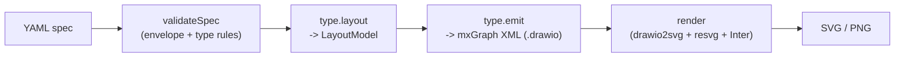

# Architecture — drawio-diagrams generator

This is the map for anyone (human or LLM) editing the generator. Read this first, then edit
the ONE module that owns the thing you want to change. Every source file also carries a
header block with **Responsibility / Edit here when / Do NOT** — trust it.

## Pipeline



The core (`generate.mjs`, `validate.mjs`, `lib/spec.mjs`, `render.mjs`) is **type-agnostic**:
it never imports a concrete type. It goes through the registry (`types/index.mjs`) and the
uniform `DiagramType` interface `{ type, title, validate, layout, emit }`. Adding a diagram
type = add a folder under `types/<type>/` and register it — nothing in the core changes.

## The one hard rule (render-safe)

`resvg` (the browserless rasterizer) cannot render `<foreignObject>`, which is what draw.io
uses for HTML labels. Therefore emitters must produce **only native SVG `<text>`**: style
strings must never contain `html=1` or `whiteSpace=wrap`, and multi-line text must be
pre-split into lines by the layout (see `lib/text.mjs`). The `emit` and `render` tests guard
this; the emit golden guards output byte-for-byte.

## Module map — "to change X, edit Y"

Core / CLI (type-agnostic):

- `generate.mjs` — primary CLI: specs -> `.drawio` + `.png` + JSON manifest. Edit for CLI
  surface, output naming, manifest shape.
- `validate.mjs` — CLI: validate specs, human output, exit codes.
- `render.mjs` — XML -> SVG -> PNG with the bundled Inter font. Edit for rasterization opts.
- `lib/spec.mjs` — YAML parsing, markdown block extraction, envelope validation + dispatch.
- `lib/cli.mjs` — shared arg parsing + exit helpers.
- `lib/xml.mjs` — XML escaping / multiline / number formatting shared by emitters.
- `lib/mxgraph.mjs` — shared serialization primitives (`cell`, `edge`, `mxfile` envelope with
  the base64 `data-spec`) used by EVERY type's emitter. A change here affects all types; the
  emit-golden snapshots guard against drift.
- `lib/text.mjs` — `wrapText` (layout-time wrapping; the render-safe path forbids CSS wrap).
- `lib/design.mjs` — shared **design tokens** (palette, font, strokes, radius) for ALL types.
- `lib/types.mjs` — JSDoc `@typedef`s for every cross-boundary shape (Spec/Model/DiagramType).
- `lib/text-measure.mjs` — heuristic text measurement provider drawio2svg needs headless.
- `lib/drawio2svg.mjs` — vendored, **frozen** bundle (do not hand-edit; see "Vendored renderer" below).
- `types/index.mjs` — the registry + `assertType` gate.
- `types/contract.mjs` — the `DiagramType` contract + runtime shape-check.

Sequence type (`types/sequence/`):

- `index.mjs` — the DiagramType facade (binds validate/layout/emit).
- `geometry.mjs` — sequence spatial constants `L` (widths, gaps, margins, char budgets).
- `styles.mjs` — render-safe mxGraph style strings `S`, assembled from `lib/design.mjs`.
- `rules.mjs` — authoring-rule catalog (R1..R6) + `cite()` for validator messages.
- `validate/index.mjs` — structural + text-budget checks (R3/R4/R5) + envelope of the checks.
- `validate/flow.mjs` — synchronous call-stack simulation (R1/R2).
- `layout/index.mjs` — orchestrator: composes the phases into a `LayoutModel`.
- `layout/columns.mjs` — phase 0: columns + participant boxes + header text cells.
- `layout/callTree.mjs` — phase 1: activation (call) tree from the messages.
- `layout/activations.mjs` — phases 2/3: recursive frame sizing + row Y, then bar rectangles.
- `layout/messages.mjs` — phase 4: arrows + labels (call/return/self geometry).
- `layout/notes.mjs` — phase 5: notes anchored under a single participant.
- `emit.mjs` — serialize the `LayoutModel` into render-safe mxGraph XML (via `lib/mxgraph.mjs`).

Flow type (`types/flow/`):

- `index.mjs` — the DiagramType facade (binds validate/layout/emit).
- `geometry.mjs` — flow spatial constants `F` (box sizing, grid gaps, lane/label spacing).
- `styles.mjs` — render-safe mxGraph style strings `S`, assembled from `lib/design.mjs` (reuses
  sequence's visual language: same ink, stroke hierarchy, radius, two-tier header text).
- `rules.mjs` — authoring-rule catalog (F1..F5) + `cite()` for validator messages.
- `cells.mjs` — the single source of truth for resolving each node's (row, col); shared by
  `validate.mjs` and `layout/grid.mjs` so they can never disagree.
- `validate.mjs` — structural + text-budget checks (F1..F5).
- `layout/grid.mjs` — phase 0: content-size each node; place columns/rows (column = widest node,
  row = tallest node); center nodes in their cells + build header text cells.
- `layout/edges.mjs` — phase 1: derive attach sides from the grid delta, spread shared sides into
  lanes, route one orthogonal bend for diagonals, and place labels beside the arrow.
- `layout/index.mjs` — orchestrator: composes the phases, then normalises the canvas offset/size.
- `emit.mjs` — serialize the `FlowLayoutModel` into render-safe mxGraph XML (via `lib/mxgraph.mjs`).

## Extending — add a diagram type

1. Create `types/<type>/` exporting `{ type, title, validate, layout, emit }`.
2. Reuse the kernel: `lib/design.mjs` (visual language), `lib/text.mjs`, `lib/xml.mjs`,
   `lib/types.mjs`. Put per-type spatial numbers in your own `geometry.mjs`.
3. Register it in `types/index.mjs` (wrapped in `assertType`).
4. `layout` derives ALL geometry from the spec; `emit` stays render-safe.

## Tests + safety net

- `npm run test:diagrams` (or `node --test scripts/tests/*.test.mjs`).
- `tests/golden.test.mjs` locks emit output byte-for-byte — any diff is an accidental
  behavior change. Regenerate intentionally only for a deliberate visual change (command in
  that file's header).

## Vendored renderer (frozen)

`lib/drawio2svg.mjs` is a committed, self-contained ESM bundle. It is the only thing the
render path needs at runtime — there is **no build step** and the build tooling has been
removed to keep installs lean (a plain `npm install` pulls only the runtime deps:
`@resvg/resvg-js`, `@xmldom/xmldom`, `yaml`, …).

If you ever need to **regenerate** it (e.g. to pick up an upstream fix), the source is the
TypeScript package `@markdown-viewer/drawio2svg`. Re-bundle it to a single pure-ESM file so it
runs on plain Node with no TS loader:

```bash
npm i -D esbuild @markdown-viewer/drawio2svg   # add tooling back temporarily
npx esbuild "$(node -p "require.resolve('@markdown-viewer/drawio2svg')")" \
  --bundle --format=esm --platform=node --target=node20 \
  --conditions=browser --legal-comments=none \
  --outfile=scripts/lib/drawio2svg.mjs
npm uninstall esbuild @markdown-viewer/drawio2svg   # remove tooling again
```

`--conditions=browser` is essential: it resolves `@markdown-viewer/text-measure` via its clean
`browser` export instead of the `node` entry (which auto-imports a fibjs/webview provider that
depends on `gui`/`coroutine`, absent in Node). We supply our own text-measure provider at
runtime in `render.mjs` (`lib/text-measure.mjs`). `@resvg/resvg-js` is a native addon consumed
directly by `render.mjs` and is not bundled.

## Sequence type — design decisions (dev)

Rationale behind the sequence geometry and visual style. The user-facing authoring rules
(R1..R6, spec vocabulary, label guidance) live in `references/sequence.md`; this section is the
"why" for maintainers. Exact numbers are in `types/sequence/geometry.mjs` + `lib/design.mjs`.

### Geometry (derived from the call stack, never from arrows)

- **G1 — activation height is recursive.** Leaf frame = `MIN_ACTIVATION_HEIGHT`; container =
  `ACTIVATION_GAP` + Σ(children, `SIBLING_GAP` between) + `ACTIVATION_GAP`. The inter-sibling gap
  drops to `SELF_SIBLING_GAP` (half) where a self block abuts a neighbour, so internal work sits
  tighter to the call around it. Arrows attach to the computed edges (call -> top, return ->
  bottom). This inverts the old approach of inferring height from arrow positions.
- **G2 — one rectangle per frame.** A participant active more than once gets several bars.
- **G3 — self = rectangle-on-rectangle.** A `self` is a small nested activation (height
  `SELF_NEST_H` = 0.75 · `MIN_ACTIVATION_HEIGHT`) entered by a short hook from the main bar;
  the hook starts in the gap above the block and its arrowhead enters at mid-height. Every
  `self` gets its own block — including one immediately followed by an outgoing call (the
  internal work still reads as a distinct frame). The sizing phase always reserves the block's
  height, so drawing it never shifts any other row.
- **G4 — labels pinned to the arrowhead at a constant pixel gap.** `LABEL_GAP` px before the
  target regardless of arrow length (relative position solved as `labelX = 1 − 2·gap/length`).
  Returns use a 30% larger gap; the self label is centered on the hook's right segment.
- **G5 — headers.** Box headers are taller than the actor figure (`HEADER_BOX_H`, grown upward
  so all bottoms share the actor-figure baseline) and narrower (`HEADER_W`); corner rounding is
  a small fixed radius (`absoluteArcSize=1;arcSize=7`).
- **G6 — compact column spacing.** Variable step: actor↔component = `COL_STEP ·
  COL_STEP_ACTOR_FACTOR`, component↔component = `COL_STEP · COL_STEP_COMPONENT_FACTOR`.
- **G7 — render-safe styles only.** Native SVG `<text>` (see "The one hard rule" above).
- **G8 — two-tier header text as a centered static group.** The lifeline shape draws only the
  box/figure; `title` + optional `subtitle` are separate native-text cells centered as a group
  of fixed line-heights. Box width is fixed, so text is capped (R3), not the box grown.
- **G9 — bundled font for cross-OS determinism.** `render.mjs` loads a vendored variable
  **Inter** TTF and sets resvg `loadSystemFonts:false`, so PNGs are byte-identical on every OS.
- **G10 — self label: fixed width, left-aligned wrap.** Bounded by the next participant's
  lifeline (minus a keep-out) — not its header box, since at the message rows the next column is
  just a thin line — so it uses the full inter-column gap and wraps onto left-aligned lines.
- **G11 — notes under a single participant.** Fixed-max-width box (`NOTE_MAX_W` = 1.5× the
  participant box) centered on the `under` column, wrapped. All notes share one top y — a single
  horizontal band below the lifelines (top-aligned; x clamped so it never clips off-canvas;
  diagram width/height grow to include them).

### Design tokens

One artifact that reads for BOTH execs and devs: monochrome near-black ink + **one** accent;
message TYPES are carried by line-style + arrowhead (never colour) → colourblind- and
print-safe. Values in `lib/design.mjs` (`COLORS`, `TYPE`, `STROKE`, `RADIUS`), wired into
styles in `types/sequence/styles.mjs`.

- **Colour:** `INK #172B4D` (titles, box borders), `INK_BODY #374151` (call/self labels,
  notes), `MUTED #666` (subtitles, return labels — 5.7:1 AA), `LINE #8A94A6` (lifelines /
  activation borders, ≥3:1), `ACCENT #0C66E4` (the single accent: actor / primary path),
  `PANEL #F7F8F9` (note fill). Background pure white.
- **Type (Inter, bundled):** title 13/bold, subtitle 11/regular muted; message/label styles
  inherit the default size (do not add sizes without a deliberate change — it breaks the emit
  golden). Actor title in accent.
- **Stroke hierarchy:** box + sync call 1.5, return 1.25 dashed (open head), lifeline &
  activation border 1. Consistency of stroke weight is the main "polished" signal.
- **Shape:** corner radius fixed ~7. Flat — no gradients/shadows (unreliable through resvg,
  and read as dated).
- **Not adopted (deliberately):** multi-hue semantic palette, legend, title/caption chrome.

### Deferred / known-open (NOT bugs — intentional)

Recognized and intentionally deferred; do not "fix" them with a workaround:

- **Renderer tolerates unclosed frames** vs R2's "all frames close". The fallback is kept as
  defense-in-depth; the spec contract is still "all frames close".
- **`return` to the *exact* caller is not separately validated.** R1 checks the returner is the
  active flow and R6 checks the return travels right→left (never a rightward hand-off), but
  neither asserts `to` is the specific participant that opened the frame. A dedicated "return
  goes to its caller" check could be added later.
- **Lifeline styling is coupled to the header box.** The `umlLifeline` shape draws the box
  border AND the dashed lifeline with one `strokeColor`/`strokeWidth`, so lifelines share the
  box's navy/1.5. Styling them independently means drawing the header as a plain rounded rect +
  a separate dashed lifeline edge. Deferred.

## Flow type — design decisions (dev)

Rationale behind the flow geometry and visual style. The user-facing authoring rules (F1..F5,
spec vocabulary, label guidance) live in `references/flow.md`; this section is the "why" for
maintainers. Exact numbers are in `types/flow/geometry.mjs` + `lib/design.mjs`.

### Manual grid, not auto-layout

Flow is a **graph**, not a call stack, so there is no structure to derive geometry from. Rather
than build an auto graph-layout engine (layered ranks + edge routing + crossing minimisation —
hard to keep deterministic AND pretty), the author places nodes on a grid and the engine only
computes pixels. This mirrors how a human arranges a diagram and keeps the "same spec always
renders identically" guarantee.

- **FL1 — column = within-row index (overridable).** A node's column defaults to its position
  among the nodes in its row (see `cells.mjs`), so nodes listed first line up into a vertical
  spine — the common case, zero ceremony. An explicit `col` pins a node under a specific column
  (e.g. a lone decision under the middle of three boxes). `cells.mjs` is shared by validate and
  layout so they can never disagree.
- **FL2 — fixed box size.** Every box is a constant `BOX_W`×`BOX_H` (the title+subtitle group is
  centered inside), so boxes line up into a uniform grid and a subtitle never changes a box's
  footprint. Because the size is fixed, the F3 text budgets (`TITLE_MAX_CHARS`/`SUBTITLE_MAX_CHARS`)
  are derived from `BOX_W` and enforced up front — over-budget text is rejected rather than
  overflowing (there is no wrapping inside a box, per the render-safe rule). Column width = widest
  node in the column; row height = tallest node in the row (a decision is the only taller node).
- **FL3 — sides derived from the grid delta.** An edge whose `to` is below its `from` exits the
  bottom and enters the top; to the right, right→left; etc. Row difference dominates (vertical) for
  the target side and for a box source. A **decision source is special**: its branches leave by
  column delta from the **left/right vertices** (or the bottom/top tip when the branch is straight
  down/up), so the two outcomes fan out of opposite corners instead of stacking on one tip.
- **FL4 — lane distribution.** Several edges on one node side are spread into parallel lanes
  (symmetric offsets of `LANE_GAP` from the side centre; 1 edge → centre, 2 → ±half), ordered by
  the other endpoint's position along that side. This is what keeps the `notify`/`subscribe` pair
  from overlapping. A `decision` uses offset 0 (its edges land exactly on the vertex/tip).
- **FL5 — orthogonal bends.** Endpoints and any waypoints are absolute/explicit — we never rely on
  the renderer's edge routing (confirmed: the frozen `drawio2svg` draws explicit
  `sourcePoint`/waypoints/`targetPoint` but does not run mxGraph edge-style routing). Same-axis
  ends (both vertical or both horizontal) that are not aligned get a **Z** with the mid-run on the
  shared axis; a **decision branch** — horizontal out of a vertex into a vertical top/bottom — gets
  a single **L**-bend at the corner; aligned straight runs get none.
- **FL6 — labels.** A label sits a constant `LABEL_SIDE_GAP` off the arrow: for a straight vertical
  arrow to the right by default (left for the left arrow of a pair, so a two-arrow channel reads
  cleanly); for a horizontal arrow, above; for a same-axis **Z**-bend, on the middle run; for a
  **decision branch** (mixed-axis L) above the horizontal leg that leaves the diamond, which pushes
  the two branch labels out to opposite sides of the vertex.
- **FL7 — canvas normalisation.** After layout, everything is translated so the top-left of the
  content sits at the margin (a left-side label can stick out past column 0), then width/height
  come from the content bounding box.

### Design tokens + shapes

Flow reuses the shared tokens (`lib/design.mjs`) so it reads as one family with sequence:
`box`/`decision` use the navy `INK` border at `STROKE.EMPHASIS`, the subtle `PANEL` fill, and the
fixed `RADIUS`; titles are bold `INK`, subtitles smaller `MUTED`; the single arrow is `INK_BODY`
at `STROKE.EMPHASIS` with a filled block head. Text is rendered as separate native-`<text>` cells
(render-safe), never as the shape's own HTML label.

A **decision** carries no text — it is a fixed, compact diamond (`DECISION_W`×`DECISION_H`, the
same width as a box so the spine stays aligned, a touch taller). Its meaning lives entirely on the
branch labels
(F4 requires a descriptive guard on each), which keeps the small diamond from ever having to fit
cramped text and forces authors to write the real condition on the arrow (not a bare `yes`/`no`).

### Deferred / known-open (NOT bugs — intentional)

- **No `fork`/`join`, swimlanes, or multiple arrow styles in v1.** The grid + box/decision cover
  the target cases; these are additive on the same grid later.
- **Multiple branches on one decision side share a vertex.** Branches are routed by column delta
  to the left/right vertex (or the tip); if two branches happen to fall on the *same* side they
  land on the same vertex (offset 0, no lane spread) and separate only via their bends. The common
  case (one branch left, one right) is clean; per-side lane spread on decisions is deferred.
- **Character-count budgets, not glyph metrics.** Boxes are a fixed size; the F3 char budgets that
  guarantee text fits (and edge-label wrap widths) use a character-count heuristic that slightly
  over-estimates, so text never overflows. Exact centring of proportional text is approximate by
  design (determinism wins).
